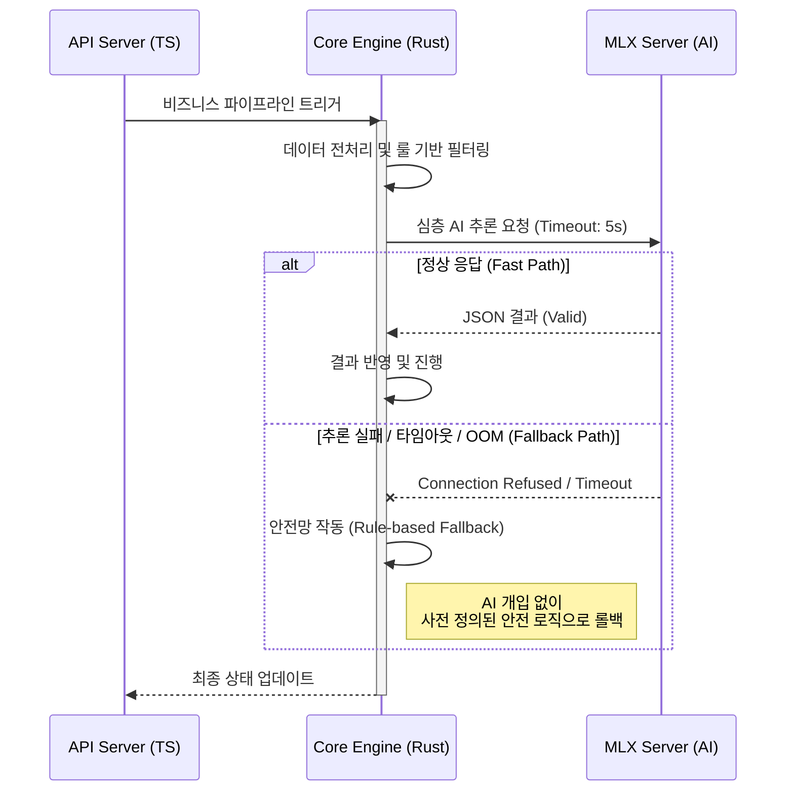

# Chapter 3: High-Performance Serving Architecture

> **"결국, AI는 현실의 비즈니스 로직과 초저지연(Low-Latency)으로 결합해야 한다"**

## 1. 아키텍처 도입 배경: API의 한계와 실시간 처리의 필요성

전담 서비스를 고도화하는 과정에서, 외부 클라우드 AI API(OpenAI, Anthropic 등)에 의존하는 구조는 명확한 한계를 드러냈습니다.
- **비용과 지연 시간(Latency):** 실시간으로 쏟아지는 데이터 파이프라인에 AI 추론을 태우기에는 네트워크 왕복 비용(RTT)이 너무 컸습니다.
- **보안 (사내망 제약):** 민감한 데이터를 외부로 내보낼 수 없는 엔터프라이즈 환경이었습니다.

결국, **사내 로컬 장비(Apple Silicon M4)의 자원을 극대화하여 초저지연으로 AI를 서빙하고, 메인 비즈니스 로직을 병목 없이 처리할 수 있는 고성능 서빙 아키텍처**를 직접 설계하게 되었습니다. (트레이딩 파이프라인에서 영감을 받은 구조 적용)

---

## 2. System Architecture: Hybrid Execution Engine

단일 스레드 기반의 Node.js 환경은 실시간 이벤트 스트리밍과 고도의 수학적 처리(퀀트/분석)에 취약합니다. 이를 극복하기 위해 프론트엔드/API 레이어(Node.js/TS)와 고성능 실행 코어(Rust), 그리고 AI 추론(Python/MLX)을 결합한 하이브리드 아키텍처를 구축했습니다.

```mermaid
graph TD
    subgraph "Presentation & API (Node.js/TS)"
        UI[Dashboard UI]
        API[Fastify API Server]
        UI <--> API
    end

    subgraph "Core Execution Engine (Rust)"
        EB[EventBus (Lock-free MPSC Queue)]
        PA[Pipeline Agent / Worker]
        RG[Guard & Validator]
        
        API -.->|Commands| EB
        EB --> PA
        PA --> RG
    end

    subgraph "AI Inference Server (Apple Silicon Native)"
        MLX[MLX-LM Server / vLLM]
        NAS[(NAS Storage / Memory Mapped)]
        MLX <--> NAS
    end

    PA <-->|Zero-latency Local HTTP/gRPC| MLX

    classDef ts fill:#f9f2f4,stroke:#d49a89,stroke-width:2px;
    classDef rust fill:#f4f4f9,stroke:#89a8d4,stroke-width:2px;
    classDef ai fill:#f4f9f4,stroke:#89d49a,stroke-width:2px;

    class UI,API ts;
    class EB,PA,RG rust;
    class MLX,NAS ai;
```

* **Rust EventBus:** 고부하 상황에서도 스레드 블로킹(Thread Blocking)을 방지하는 Lock-free MPSC(Multi-Producer, Single-Consumer) 큐 기반의 이벤트 버스. Node.js가 놓치는 실시간 데이터 파이프라인을 담당.
* **Apple Silicon MLX-LM:** M4 칩의 UMA(Unified Memory Architecture)를 활용, 수십 기가의 모델(Qwen 3.5 등)을 RAM에 상주시켜 VRAM 병목 없이 초고속으로 추론. 네트워크를 타지 않는 Local API를 통해 Rust 엔진과 통신.

---

## 3. 안정성과 회복 탄력성 (Resilience & Fallback)

200명 규모의 기업 시스템에 연동되는 전담 서비스로서, AI 모듈이 죽더라도 메인 서비스는 멈추지 않아야 합니다.



> [!TIP]
> **Strangler Fig 패턴을 통한 점진적 이관**
> 기존 Node.js 기반의 거대한 레거시를 한 번에 Rust로 재작성하는 것은 자살 행위입니다. 저는 **Strangler Fig 패턴**을 적용하여, 성능이 크리티컬한 부분(데이터 파이프라인, AI 추론 연동 부)만 Rust로 조각내어 이관하고, 기존 API는 그대로 유지하며 무중단으로 아키텍처를 고도화했습니다.
