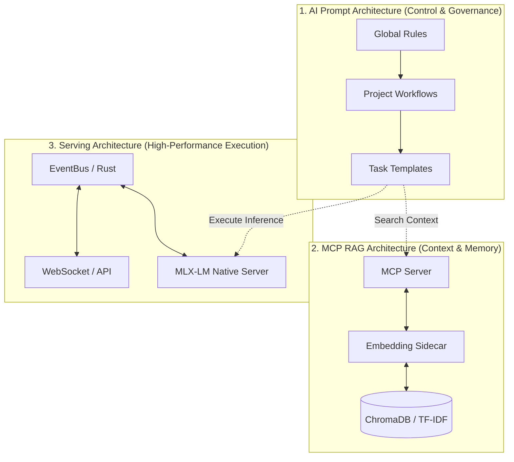

# From Software Engineer to AI System Architect: The Enterprise AI Architecture Whitepaper

> **"방대한 엔터프라이즈 도메인과 레거시 시스템의 복잡성을 통제하고, 개발 조직의 생산성 병목을 해결하기 위한 자율형 AI 인프라 아키텍처 도입기"**

## 1. Background: 엔터프라이즈 환경의 복잡성 통제와 AI 전환 시나리오

10년 차 플랫폼 엔지니어이자 아키텍트로서, 수많은 마이크로서비스와 방대한 레거시가 얽혀있는 대규모 핵심 서비스를 운영하며 **기존의 선형적인 인력 투입 방식으로는 폭발적으로 증가하는 시스템의 복잡성을 감당할 수 없음**을 절감했습니다. 시스템의 확장성을 확보하고 개발 조직의 높은 인지적 부하(Cognitive Load)를 줄이기 위해, 초기에는 범용적인 AI 도구(GitHub Copilot, ChatGPT 등)를 도입하여 생산성 개선을 시도했습니다. 

하지만 단순한 '프롬프트 타이핑'과 '단편적인 코드 생성'만으로는 비즈니스 로직의 깊은 컨텍스트와 거대한 레거시 시스템을 제어할 수 없었습니다. 범용 AI는 어제 정의한 아키텍처 규칙을 오늘 잊어버렸고, 존재하지 않는 사내 DB 스키마를 환각(Hallucinate)했으며, 여러 프로젝트 간의 복잡한 의존성을 혼동했습니다.

**"AI를 단순한 코드 생성기가 아닌, 시스템의 맥락을 완벽히 이해하고 인프라와 상호작용하는 자율적인 에이전트 그룹으로 격상시켜야 한다."**

이 깨달음이 본 프로젝트의 출발점이 되었습니다. 단순 API 호출 수준의 활용을 넘어, **AI 에이전트가 조직의 도메인 지식을 스스로 검색하고, 제로 트러스트(Zero-Trust) 환경에서 안전하게 데이터를 다루며, 고성능으로 실시간 의사결정을 내릴 수 있는 근본적인 아키텍처**를 설계하고 구축했습니다. 

그 결과, 복잡한 레거시 도메인 파악 및 온보딩에 소요되는 시간을 획기적으로 단축하고, AI 환각으로 인한 치명적인 오류를 원천 차단하여 인력 증원 없이도 시스템을 안전하게 확장할 수 있는 자동화 기반을 마련했습니다. 

이 백서 시리즈는 그 결과물인 **'3대 핵심 AI 플랫폼 아키텍처'**에 대한 기술 포트폴리오입니다.

---

## 2. Tech Stack

- **Core & Backend:** `Rust`, `TypeScript`, `Node.js`
- **AI & Data:** `MLX-LM` (Apple Silicon Native), `ChromaDB`, `Python`, `TF-IDF`
- **Architecture & Protocol:** `MCP` (Model Context Protocol), `CQRS`, `Strangler Fig Pattern`, `Zero-Trust`
- **Infrastructure:** `Terraform`, `Ansible`, `Kubernetes`, `Apache Kafka`, `ELK Stack`, `AWS (EKS/MSK/OpenSearch)`

---

## 3. Core Architecture Overview

본 아키텍처는 3개의 독립적이고 유기적인 시스템으로 구성됩니다. 이는 기업의 엔터프라이즈 AI 도입 시 필수적인 **통제(Governance), 컨텍스트(Knowledge), 실행(Execution)**의 3박자를 완벽하게 커버합니다.

---

## 4. The 3 Whitepapers

아래의 문서를 통해 각 아키텍처의 설계 철학과 구현 상세를 확인할 수 있습니다. 모든 설계는 사내 기밀이나 민감 정보를 배제한 **범용적이고 확장 가능한 시스템 아키텍처 패턴**으로 기술되었습니다.

### 📄 [Chapter 1: AI Prompt Architecture](./01-ai-prompt-architecture.md)
* **목표:** AI의 환각을 통제하고, 일관된 결과를 보장하는 에이전트 거버넌스 시스템
* **핵심 내용:**
  * 3-Layer Rule System (System -> Project -> Task)을 통한 컨텍스트 상속 구조
  * `g-plan` -> `run` -> `handoff` -> `done`으로 이어지는 자율형 상태 전이(State Transition) 워크플로우 설계

### 📄 [Chapter 2: MCP (RAG) Architecture](./02-mcp-rag-architecture.md)
* **목표:** 복잡한 레거시 코드와 방대한 도메인 지식을 AI에게 실시간으로 주입하는 지식 미들웨어
* **핵심 내용:**
  * IDE와 독립적으로 통신하는 표준 MCP(Model Context Protocol) 서버 구축
  * Python 임베딩 사이드카와 TF-IDF 메모리 폴백을 결합한 3-Tier 검색 파이프라인
  * 제로 트러스트(Zero-Trust) 기반의 프로젝트 도메인 격리 아키텍처

### 📄 [Chapter 3: High-Performance Serving Architecture](./03-serving-architecture.md)
* **목표:** 클라우드 의존성 없이, 초저지연(Low-Latency) 로컬 환경에서 실시간 AI 추론 및 실행
* **핵심 내용:**
  * Apple Silicon(M4) UMA 메모리 구조를 극대화한 MLX 네이티브 모델 서빙 (Qwen 3.5)
  * Rust 기반의 EventBus 아키텍처를 통한 비동기 트레이딩/파이프라인 실행
  * Node.js 한계를 극복하기 위한 Strangler 패턴의 하이브리드 언어(Rust + TS) 설계

### 🏗️ [Chapter 4: Infrastructure Core Demo](./demo/infra-core-demo/README.md)
* **목표:** 실운영 수준의 AWS 기반 인프라 공통 코어 아키텍처 데모
* **핵심 내용:**
  * **IaC (Terraform):** VPC → EKS → MSK → OpenSearch 모듈 체이닝 + Remote State (S3/DynamoDB)
  * **Failback by Design:** Circuit Breaker (Closed/Open/Half-Open) + Redis Fallback + DLQ 패턴
  * **Kafka 공통 SDK:** 멱등(Idempotent) 프로듀서 + DLQ Consumer + Graceful Shutdown
  * **BFF 서비스:** 서비스 집계 + 서비스별 독립 Circuit Breaker + Rate Limiting
  * **ELK 파이프라인:** Filebeat DaemonSet → Logstash (Grok 파싱) → Elasticsearch → Kibana 대시보드
  * **Config Management (Ansible):** EC2 태그 기반 동적 인벤토리 + Role 기반 멱등 플레이북
  * **K8s (Kustomize):** PDB + HPA + Anti-Affinity + IRSA + ALB Ingress

---

*© 2026. 개인 포트폴리오 목적으로 작성되었으며, 실제 상용 서비스의 민감 정보 및 사내 코드는 포함되어 있지 않습니다.*

