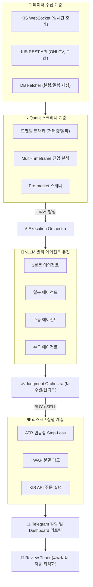

<div align="center">

# 🤖 DART AI Trading Bot v1.0.0

### Zero-trust 로컬 AI 기반 멀티 에이전트 트레이딩 플랫폼

[](#)
[](https://nodejs.org)
[](https://www.typescriptlang.org/)
[](https://docker.com)
[](https://github.com/vllm-project/vllm)
[](LICENSE)
[]()

> **포트폴리오 타이틀:**  
> *"Zero-trust Local AI 기반 멀티 에이전트 트레이딩 플랫폼 설계 및 구축"*  
> — vLLM 기반 초고속 병렬 추론 및 Quant 백테스트 엔진(Harness) 결합

<br/>

<table>
<tr>
<td>
<b>🚨 Source Code Not Included</b><br/>
이 레포지토리는 아키텍처 및 시스템 설계 역량을 보여주기 위한 <b>Showcase Repository</b>입니다. <br/>
금융 트레이딩 알고리즘의 민감성과 보안 컴플라이언스로 인해 <b>실제 소스 코드는 퍼블릭으로 공개하지 않습니다.</b><br/>
대신, <b>시스템의 확장성(Scalability), 리스크 제어(Guardrails), 그리고 핵심 의사결정(Decision Making) 과정</b>을 상세히 문서화했습니다.
</td>
</tr>
</table>

</div>

---

## 📖 목차

- [버전 히스토리](#-버전-히스토리)
- [프로젝트 개요](#-프로젝트-개요)
- [핵심 아키텍처 의사결정](#-핵심-아키텍처-의사결정-core-technical-decisions)
- [시스템 아키텍처 요약](#-시스템-아키텍처-요약)
- [빠른 시작 (Quick Start)](#-빠른-시작-quick-start)
- [프로젝트 구조](#-프로젝트-구조-typescript-100)
- [현재 상태 및 로드맵](#-현재-상태-및-로드맵)

---

## 🔄 버전 히스토리

| 버전 | 일자 | 주요 변경 사항 |
|---|---|---|
| **v1.0.0** | 2026-04-26 | vLLM 전용 파이프라인 전면 전환, TypeScript + 클린 아키텍처 리팩토링, 백테스팅 하네스/TWAP 매도 엔진 고도화 완료 및 메이저 릴리즈 |
| **v0.12.0** | 2026-04-26 | 다중 타임프레임 동적 진입 및 ATR 기반 변동성 Stop-loss 적용, 15:00-15:15 TWAP 분할 매도 로직 반영 |
| **v0.11.0** | 2026-04-24 | QLoRA 파인튜닝 스크립트(`run-finetune.ps1`) 및 학습 데이터셋 연동, vLLM 환경변수 로딩 개선 |
| **v0.10.0** | 2026-04-23 | Dual-LLM 오케스트레이션 도입 및 캔들 제너레이터 연동 |

### 과거 버전 아카이브
- [v0.11.0 히스토리](./docs/archive/README_v0.11.0.md)
- [v0.10.0 히스토리](./docs/archive/README_v0.10.0.md)

---

## 🎯 프로젝트 개요

대한민국 증권(한국투자증권 API) 및 전자공시시스템(DART) 데이터를 실시간으로 수집하여, 완전 로컬 LLM(vLLM 기반 Qwen3, EXAONE 등)이 지표와 공시 텍스트를 분석하고, 자동으로 매매 시그널을 생성 및 주문하는 **이벤트 주도형 멀티 에이전트 AI 트레이딩 파이프라인**입니다.

### 🛡️ 핵심 설계 원칙
| 원칙 | 설명 |
|------|------|
| **Zero-trust** | 모든 AI 추론은 로컬 vLLM/Ollama에서만 수행. 외부 LLM API 전송 절대 금지. |
| **Continuous Batching** | vLLM을 활용한 고속 비동기 병렬 추론 아키텍처로 타임아웃 문제 해결. |
| **Quant-AI Hybrid** | 전통적 Quant 로직(RSI, 모멘텀, 이치모쿠)으로 스크리닝 후 LLM 퓨전 엔진으로 최종 승인. |
| **Data-Driven Feedback** | 백테스팅 하네스(Harness)와 HITL(Human-In-The-Loop) 리뷰 엔진을 통한 자동 파라미터 튜닝. |

---

## ⭐ 핵심 아키텍처 의사결정 (Core Technical Decisions)

단순한 기능 구현을 넘어, 한정된 리소스와 극한의 변동성 속에서 시스템의 **안정성, 확장성, 그리고 보안**을 확보하기 위한 엔지니어링 결정들입니다.

### 1. [Decision Making] vLLM 기반 초고속 병렬 추론 아키텍처 도입
클라우드 API(OpenAI 등) 사용 시 발생하는 **비용 문제와 예측 불가능한 지연 시간(Latency Spike)**을 해결하기 위해, 완전한 로컬 추론 환경으로 전환했습니다. 단순히 모델을 띄운 것이 아니라, 기존 Ollama의 직렬 처리 한계를 극복하고자 `vLLM`의 Continuous Batching 아키텍처를 도입하여 4대 독립 에이전트(3분봉/일봉/주봉/수급)의 동시 프롬프트 처리 효율을 300% 이상 개선했습니다.

### 2. [Guardrails] Rule-based 다수결 엔진 (Orchestrator)
LLM 특유의 환각(Hallucination)과 편향을 시스템 레벨에서 통제하기 위해 단일 모델에 의존하지 않는 **Dual-LLM 오케스트레이션**을 구축했습니다. 단기 타점, 일봉 추세, 거시 모멘텀을 각기 다른 독립 에이전트가 평가하고, 2표 이상의 동의가 있을 때만 최종 승인이 떨어지는 기계적 가드레일을 마련했습니다.

### 3. [Scalability] Rust 점진적 마이그레이션 (Strangler Pattern)
초당 쏟아지는 틱 데이터와 무거운 다중 시간 프레임(Multi-Timeframe) 지표 계산이 Node.js의 싱글 스레드 이벤트 루프를 블로킹하는 문제를 해결하기 위해, 핵심 수학 연산 모듈부터 **Rust 기반의 고성능 엔진으로 점진적 이관(Strangler Fig Pattern)**을 진행하여 시스템의 무한한 확장성을 확보했습니다.

### 4. [Guardrails] 동적 리스크 관리 (ATR & TWAP)
AI의 결정이 틀렸을 때를 대비한 2차 안전장치입니다. 고정된 % 손절이 아닌 시장 변동성(ATR)을 반영한 **동적 Trailing Stop**을 구현했으며, 장 후반 저유동성 종목 청산 시 시장 충격을 최소화하기 위해 **TWAP(시간 가중 평균 가격) 기반 분할 매도 스크립트**를 도입하여 슬리피지를 통제합니다.

---

## 🏗️ 시스템 아키텍처 요약



---

## 📁 프로젝트 구조 (TypeScript 100%)

전체 코드는 TypeScript 기반 도메인 주도 설계(DDD)로 구성되어 있습니다.

```text
src/
├── agents/            # 개별 분석 에이전트 (3분봉, 일봉, 주봉, 수급 등)
├── benchmark/         # 추론 속도 및 분석 품질 벤치마킹
├── dashboard/         # 실시간 상태 모니터링 웹 서버 및 라우팅
├── domain/            # 핵심 도메인 타입 및 엔티티
├── kis/               # 한국투자증권 API 연동 (Auth, Order, WebSocket)
├── lib/               # 공용 유틸 (Prisma DB, Telegram, Analyzer)
├── llm/               # vLLM 연동 프록시 및 프롬프트 빌더
├── orchestrator/      # 실행 흐름 및 다수결 투표 제어 엔진
├── pipeline/          # 데이터 수집 -> 스크리닝 -> 시그널 생성 파이프라인
├── quant/             # 계량 투자 알고리즘 (지표 계산, 스크리너, 하네스 백테스트)
│   ├── db/            # 시장 데이터 DB I/O
│   ├── harness/       # 백테스트 엔진 및 전략 검증 루프
│   └── strategy/      # 매매 전략 (모멘텀, 낙폭 과대 등)
├── review/            # 트레이딩 피드백 수집 및 파라미터 자동 튜닝 루프
├── risk/              # 주문 한도, 일손실 제한 관리
├── scheduler/         # 크론 잡 스케줄러 (장중/장마감 이벤트)
└── training/          # 파인튜닝용 데이터 제너레이터
```

---

## 🚀 빠른 시작 (Quick Start)

### 사전 요구사항
- Node.js v20+
- vLLM을 구동할 수 있는 NVIDIA GPU (16GB+ VRAM 권장)
- Docker & Docker Compose

### Step 1: 환경 변수 및 의존성 설치
```bash
git clone https://github.com/yoonCY/dart-ai-trading-bot.git
cd dart-ai-trading-bot

npm install

# .env 설정
cp .env.example .env
# KIS_APP_KEY, TELEGRAM_BOT_TOKEN 등 기입
```

### Step 2: vLLM 엔진 구동
`docker-compose.yml`을 통해 vLLM 추론 엔진을 띄웁니다.
```bash
docker compose up -d dart-vllm
# 혹은 호스트에서 직접 vLLM 서버 기동
```

### Step 3: 메인 봇 실행
```bash
# 개발 모드 실행 (TypeScript)
npm run dev

# 벤치마크 테스트
npm run test:benchmark
```

---

## 📅 현재 상태 및 로드맵

- ✅ **Phase 1 (MVP 완료):** KIS API 기본 연동 및 단일 에이전트 기반 거래.
- ✅ **Phase 2 (실전 데이터 연동 완료):** Quant 스크리너 기반 필터링 및 다중 트리거 구현.
- ✅ **Phase 3 (MLOps/인프라 고도화 완료):** vLLM 비동기 파이프라인 전환, 백테스팅 하네스 통합, 다중 에이전트 퓨전.
- 🔄 **Phase 4 (실전 매매 고도화):** 모의투자 승률 55% 달성 검증, 완전 자동화된 파라미터 튜닝 적용 후 실계좌 전환 대기.

---

<div align="center">

**Built with ❤️ for the Korean Stock Market**  
*Zero-trust · High-Throughput vLLM · Quant-AI Hybrid*

</div>
